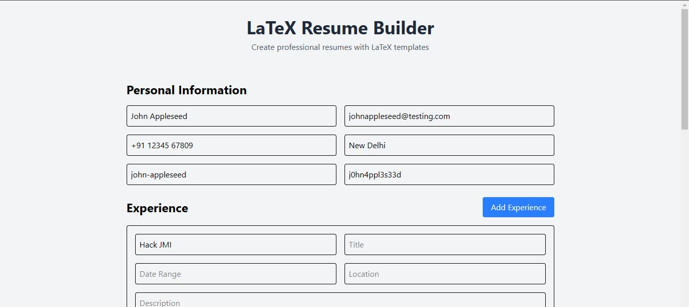
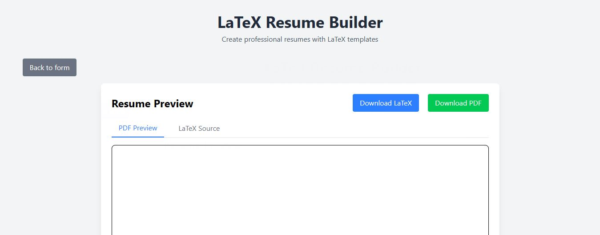
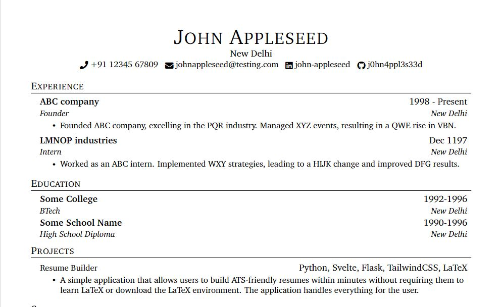

## **Res(t)YouMay – Resume Builder**  
Create LaTeX generated ATS friendly with ease

---

## Overview
**Res(t)YouMay** is an **ATS-friendly resume builder** that simplifies the process of creating professional resumes. By leveraging the **Gemini API**, it **cleans and optimizes user-provided data**, ensuring **higher chances** of passing automated screening systems and impressing HR managers. The app provides a **simple form-based interface**, generates a well-structured **PDF resume**, and allows users to download it instantly. The app allows user to also download the LaTeX source for the PDF generated so that they can make minor changes in case any are required rather than repeating the entire process once again.





---

## features :
- simple form based user input
- ai enhanced content optimization using Gemini API
- ATS friendly formatting to pass automated screenings
- (almost) instant PDF generation and download 

---

## **Installation & Setup**  

### **Steps to Run Locally:**  
```sh
# Clone the repository
git clone https://github.com/Amm4r03/hack-jmi-2025

# Navigate to the project directory
cd hack-jmi-2025

# Install dependencies
bun install

# Set up environment variables in a `.env` file
# Example:
# GEMINI_API_KEY=your-api-key

# Start the development server (within the frontend folder)
bun run dev

# start the backend server (within the backend folder)
python app.py

```

---

## **Usage**  
1. Open the app in your browser.  
2. Enter your resume details in the form.  
3. The AI will **optimize your input** for clarity and ATS compatibility.  
4. Click **"Generate Resume"** to receive a **downloadable PDF**.  

---

## **Future Enhancements**  
- allow user to import their profile from linkedin for creating resume
- incorporate multiple styles and templates for varying industries

---
